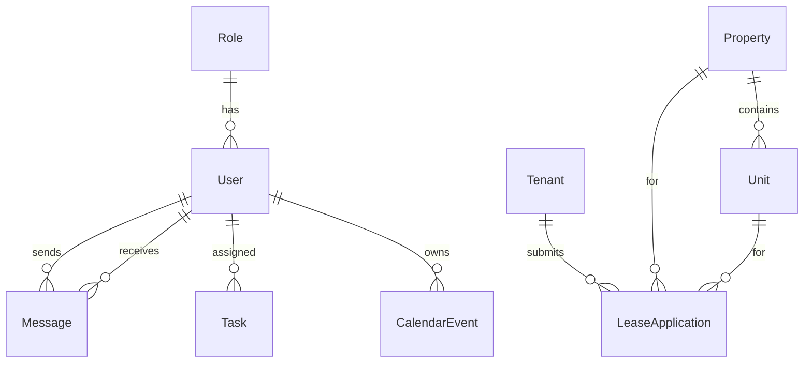

# A3Nest MAUI Project Design Document

## Overview

A3Nest is a cross-platform property management application built using .NET 8 MAUI with Clean Architecture principles. The application provides comprehensive property management capabilities including tenant management, lease applications, messaging, calendar integration, and owner portal functionality. The design emphasizes separation of concerns, testability, and maintainability through a four-layer architecture approach.

## Architecture

### Clean Architecture Layers

The application follows Clean Architecture with strict dependency rules:

```
┌─────────────────┐
│   Presentation  │ ──┐
└─────────────────┘   │
                      ▼
┌─────────────────┐ ┌─────────────────┐
│   Application   │ │     Domain      │
└─────────────────┘ └─────────────────┘
          │                   ▲
          ▼                   │
┌─────────────────┐           │
│ Infrastructure  │ ──────────┘
└─────────────────┘
```

**Dependency Flow:**
- Presentation → Application → Infrastructure
- Domain remains independent (no dependencies)
- Infrastructure implements Application interfaces
- All layers can reference Domain

### Project Structure

```
A3Nest.Solution/
├── src/
│   ├── A3Nest.Domain/
│   ├── A3Nest.Application/
│   ├── A3Nest.Infrastructure/
│   └── A3Nest.Presentation/
├── tests/
│   ├── A3Nest.Domain.Tests/
│   ├── A3Nest.Application.Tests/
│   ├── A3Nest.Infrastructure.Tests/
│   └── A3Nest.Presentation.Tests/
└── A3Nest.Solution.sln
```

## Components and Interfaces

### Domain Layer (A3Nest.Domain)

**Entities:**
- `User`: Base user entity with authentication properties
- `Role`: User roles and permissions
- `Property`: Property information and details
- `Unit`: Individual units within properties
- `Tenant`: Tenant information and lease details
- `LeaseApplication`: Lease application workflow
- `Message`: Internal messaging system
- `Task`: Task management and assignments
- `CalendarEvent`: Calendar and scheduling
- `Report`: Reporting and analytics data

**Value Objects:**
- `Address`: Property and tenant addresses
- `Money`: Financial amounts with currency
- `DateRange`: Date ranges for leases and events
- `ContactInfo`: Phone, email contact information

**Enums:**
- `UserRole`: Admin, PropertyManager, Tenant, Owner
- `PropertyType`: Residential, Commercial, Mixed
- `LeaseStatus`: Pending, Active, Expired, Terminated
- `TaskStatus`: New, InProgress, Completed, Cancelled
- `MessageType`: System, User, Notification

### Application Layer (A3Nest.Application)

**Service Interfaces:**
```csharp
public interface IPropertyService
{
    Task<PropertyDto> GetPropertyAsync(int id);
    Task<IEnumerable<PropertyDto>> GetPropertiesAsync();
    Task<PropertyDto> CreatePropertyAsync(CreatePropertyCommand command);
    Task<PropertyDto> UpdatePropertyAsync(UpdatePropertyCommand command);
    Task DeletePropertyAsync(int id);
}

public interface ITenantService
{
    Task<TenantDto> GetTenantAsync(int id);
    Task<IEnumerable<TenantDto>> GetTenantsAsync();
    Task<TenantDto> CreateTenantAsync(CreateTenantCommand command);
    Task<TenantDto> UpdateTenantAsync(UpdateTenantCommand command);
    Task DeleteTenantAsync(int id);
}

// Similar interfaces for IMessageService, ITaskService, ICalendarService, IOwnerPortalService
```

**DTOs:**
- `PropertyDto`, `TenantDto`, `UserDto`, `MessageDto`, etc.
- Request/Response DTOs for API operations
- Validation attributes on DTOs

**Commands/Queries:**
- CQRS pattern implementation
- `CreatePropertyCommand`, `UpdateTenantQuery`, etc.
- Command/Query handlers with validation

### Infrastructure Layer (A3Nest.Infrastructure)

**Database Context:**
```csharp
public class A3NestDbContext : DbContext
{
    public DbSet<User> Users { get; set; }
    public DbSet<Property> Properties { get; set; }
    public DbSet<Unit> Units { get; set; }
    public DbSet<Tenant> Tenants { get; set; }
    // Additional DbSets...

    protected override void OnModelCreating(ModelBuilder modelBuilder)
    {
        // Entity relationships configuration
        modelBuilder.Entity<Property>()
            .HasMany(p => p.Units)
            .WithOne(u => u.Property);
            
        modelBuilder.Entity<User>()
            .HasMany(u => u.SentMessages)
            .WithOne(m => m.Sender);
            
        // Additional configurations...
    }
}
```

**Repositories:**
- Generic repository pattern
- Specific repositories implementing Application interfaces
- Unit of Work pattern for transaction management

**SignalR Hubs:**
```csharp
public class MessageHub : Hub
{
    public async Task SendMessage(string userId, string message) { }
    public async Task JoinGroup(string groupName) { }
}

public class NotificationHub : Hub
{
    public async Task SendNotification(string userId, string notification) { }
}
```

**Elasticsearch Integration:**
```csharp
public class ElasticsearchIndexer
{
    public async Task IndexPropertyAsync(Property property) { }
    public async Task IndexTenantAsync(Tenant tenant) { }
    public async Task<IEnumerable<PropertyDto>> SearchPropertiesAsync(string query) { }
}
```

**External Adapters:**
- `IEmailService` implementation
- `IPushNotificationService` implementation
- Third-party API integrations

### Presentation Layer (A3Nest.Presentation)

**MAUI Shell Navigation:**
```xml
<Shell x:Class="A3Nest.Presentation.AppShell">
    <FlyoutItem Title="Dashboard" Icon="dashboard.png">
        <ShellContent Route="dashboard" ContentTemplate="{DataTemplate pages:DashboardPage}" />
    </FlyoutItem>
    <FlyoutItem Title="Properties" Icon="properties.png">
        <ShellContent Route="properties" ContentTemplate="{DataTemplate pages:PropertiesPage}" />
    </FlyoutItem>
    <!-- Additional FlyoutItems for other pages -->
    
    <TabBar x:Name="MobileTabBar">
        <Tab Title="Dashboard" Icon="dashboard.png" Route="dashboard" />
        <Tab Title="Properties" Icon="properties.png" Route="properties" />
        <!-- Additional tabs for mobile -->
    </TabBar>
</Shell>
```

**Pages and ViewModels:**
- MVVM pattern implementation
- Each page has corresponding ViewModel
- Dependency injection for services
- Async data loading with proper error handling

**Reusable Components:**
```csharp
// DataGrid component for tabular data
public partial class DataGrid : ContentView
{
    public static readonly BindableProperty ItemsSourceProperty = ...;
    public static readonly BindableProperty ColumnsProperty = ...;
}

// SearchBar with Elasticsearch integration
public partial class SearchBar : ContentView
{
    public static readonly BindableProperty SearchCommandProperty = ...;
    public static readonly BindableProperty PlaceholderProperty = ...;
}
```

## Data Models

### Entity Relationships



### Key Relationships
- **Property → Units**: One-to-Many (A property can have multiple units)
- **Tenant → LeaseApplications**: One-to-Many (A tenant can have multiple applications)
- **Role → Users**: One-to-Many (A role can be assigned to multiple users)
- **User → Messages**: One-to-Many (SenderId and ReceiverId foreign keys)
- **User → Tasks**: One-to-Many (AssignedTo foreign key)
- **User → CalendarEvents**: One-to-Many (OwnerId foreign key)

## Error Handling

### Global Error Handling Strategy
- Custom exception types for domain-specific errors
- Global exception handler in MAUI application
- Logging integration with structured logging
- User-friendly error messages with localization support

### Exception Types
```csharp
public class PropertyNotFoundException : NotFoundException { }
public class TenantValidationException : ValidationException { }
public class LeaseApplicationBusinessException : BusinessException { }
```

### Error Response Pattern
```csharp
public class Result<T>
{
    public bool IsSuccess { get; set; }
    public T Data { get; set; }
    public string ErrorMessage { get; set; }
    public List<string> ValidationErrors { get; set; }
}
```

## Testing Strategy

### Unit Testing
- Domain entities and value objects testing
- Application service testing with mocked dependencies
- Repository testing with in-memory database
- ViewModel testing with mocked services

### Integration Testing
- Database integration tests with test containers
- SignalR hub testing
- Elasticsearch integration testing
- API endpoint testing

### UI Testing
- MAUI UI testing framework
- Page navigation testing
- Component interaction testing
- Cross-platform compatibility testing

### Test Structure
```
tests/
├── A3Nest.Domain.Tests/
│   ├── Entities/
│   ├── ValueObjects/
│   └── Enums/
├── A3Nest.Application.Tests/
│   ├── Services/
│   ├── Commands/
│   └── Queries/
├── A3Nest.Infrastructure.Tests/
│   ├── Repositories/
│   ├── SignalR/
│   └── Elasticsearch/
└── A3Nest.Presentation.Tests/
    ├── ViewModels/
    ├── Pages/
    └── Components/
```

## Technology Stack

### Core Technologies
- **.NET 8**: Latest .NET framework
- **MAUI**: Cross-platform UI framework
- **Entity Framework Core**: ORM for database operations
- **SignalR**: Real-time communication
- **Elasticsearch.Net/NEST**: Search functionality

### Additional Libraries
- **CommunityToolkit.Mvvm**: MVVM helpers and source generators
- **Microsoft.Extensions.DependencyInjection**: Dependency injection
- **Serilog**: Structured logging
- **FluentValidation**: Input validation
- **AutoMapper**: Object-to-object mapping
- **xUnit**: Unit testing framework
- **Moq**: Mocking framework

### Platform-Specific Considerations
- **Windows**: WinUI 3 backend
- **macOS**: Mac Catalyst backend
- **iOS**: Native iOS backend
- **Android**: Native Android backend

## UI/UX Design Principles

### Responsive Design
- Adaptive layouts for different screen sizes
- Desktop: Sidebar navigation with detailed views
- Mobile: Tab-based navigation with simplified views
- Tablet: Hybrid approach with collapsible sidebar

### Theme Support
- Light and dark theme implementations
- System theme detection and automatic switching
- Custom color schemes for branding
- Accessibility compliance (WCAG 2.1)

### Component Design System
- Consistent spacing and typography
- Reusable component library
- Material Design principles adaptation
- Platform-specific styling where appropriate

## Performance Considerations

### Data Loading
- Lazy loading for large datasets
- Pagination for list views
- Caching strategies for frequently accessed data
- Background data synchronization

### Search Optimization
- Elasticsearch indexing for fast search
- Search result caching
- Autocomplete and suggestion features
- Search analytics and optimization

### Real-time Features
- SignalR connection management
- Efficient message broadcasting
- Connection state handling
- Offline capability with sync on reconnect